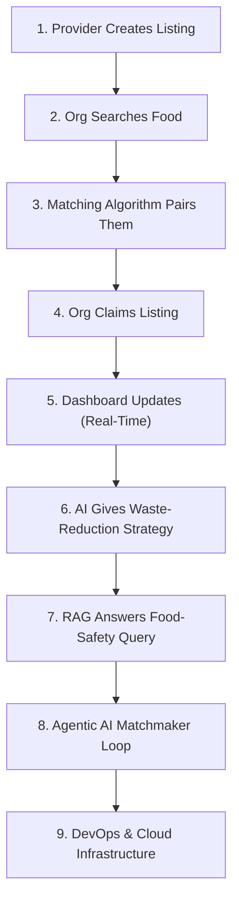

# 🎬 FoodLoop — Hackathon Required Demo Walkthrough Guide

> **Problem Statement:** PS-04 · Smart Food Rescue & Community Resource Platform  
> **Demo Flow Time:** ~3 to 5 minutes  
> **Prerequisites:** Docker containers running (`docker-compose up`) or local dev server running.

---

## 👥 Demo Personas & Fast-Login Credentials

| Role | Name | Email | Password | Primary Goal |
| :--- | :--- | :--- | :--- | :--- |
| **Provider** | Chef Ben Al-Zubair | `provider@foodloop.org` | `password123` | Log surplus food batch & view waste reduction |
| **Organization** | Sister Amina (Hope Haven) | `org@foodloop.org` | `password123` | Claim surplus food & coordinate driver pickup |
| **Admin** | Director Tariq | `admin@foodloop.org` | `password123` | Verify organizations & view municipal stats |

---

## 📋 Required Step-by-Step Demo Flow

---

### Step 1: Provider Creates Food Listing 🥗
1. Open `http://localhost:5173/login` (or click **"Sign In"** on the Landing Page).
2. Click the **"👨‍🍳 Fast Login as Food Donor"** button.
3. On the **Food Donors Hub** (`/provider`), click **"➕ New Food Listing"**.
4. Fill in the form:
   - **Food Name:** `50 Gourmet Vegetarian Rice Bowls & Fresh Salad`
   - **Category:** `Meals / Cooked`
   - **Quantity:** `50 portions`
   - **Pickup Location:** `Green Leaf Artisan Kitchen, 4th Ave`
   - **Expiry / Best Before:** `Today 9:00 PM`
   - **Dietary Tags:** `Halal`, `Vegetarian`
5. Click **"Publish Surplus Listing"**.
6. ✅ **Observation:** The listing appears immediately under **Active Surplus Batches** with status `Available`.

---

### Step 2 & 3: Organization Searches Food & Sees Match 🔍
1. Switch role to **Community Relief Portal** (`/organization`) or log in as `org@foodloop.org`.
2. Browse the **Available Food Stream**.
3. Filter by Category: `Meals` or search `Vegetarian`.
4. ✅ **Observation:** The system's OOP **FoodMatcher** calculates compatibility based on category preference, location proximity, and portion capacity:
   - **Compatibility Score: 96% Match** (Highlighted with a green badge).

---

### Step 4 & 5: Organization Claims Listing & Dashboard Updates 📦
1. On the listing card, click **"Request / Claim Food"**.
2. Enter pickup notes: `Volunteer van en route with insulated thermal carriers. ETA 19:30.`
3. Click **"Confirm Claim"**.
4. ✅ **Observation:**
   - Listing status transitions from `Available` $\rightarrow$ `Reserved`.
   - The **Organization Dashboard** updates: Active Claims increments to `1`.
   - Switch back to the **Provider Dashboard**: Status shows `Reserved by Hope Haven Community Shelter`.
   - Once picked up, click **"Mark as Collected"** $\rightarrow$ Platform CO₂ emissions diverted updates in real-time (+125 kg CO₂ diverted, +50 meals saved).

---

### Step 6: Generative AI Waste-Reduction Recommendations 💡
1. Open the floating **AI Assistant** drawer (bottom right 🌙 button).
2. Click the **"💡 Waste Strategy (GenAI)"** tab.
3. Click the prompt chip:  
   *"Analyze cafeteria surplus and recommend waste reduction steps."*
4. ✅ **Observation:** The Groq-powered GenAI model returns:
   - Specific portion planning suggestions.
   - Batch preparation adjustments based on historical surplus trends.
   - Immediate redistribution tips for perishable surplus.

---

### Step 7: RAG Knowledge Base for Food Safety 🛡️
1. In the AI Assistant, switch to the **"🛡️ Food Safety (RAG)"** tab.
2. Ask:  
   *"What temperature should hot cooked meals be held at during transit?"*
3. ✅ **Observation:**
   - RAG retrieves grounded context from `rag/knowledge-base/food_safety_guidelines.md`.
   - The AI answers with precision: **60°C (140°F) or above**, citing the **2-Hour/4-Hour safety rule** and mandatory insulated thermal carriers.
   - Grounded source references are displayed below the answer.

---

### Step 8: Agentic AI Autonomous Food Matching Loop ⚡
1. Switch to the **"⚡ Matching Agent"** tab.
2. Enter:  
   *"Find verified organizations that can use 50 available vegetarian meals."*
3. ✅ **Observation:**
   - The agent executes a multi-step tool loop:
     1. `find_available_food_tool` $\rightarrow$ Queries available surplus listings.
     2. `find_organizations_tool` $\rightarrow$ Queries verified community relief shelters.
     3. `calculate_match_score` $\rightarrow$ Runs OOP scoring algorithm.
   - Displays autonomous tool step executions and synthesized dispatch plan.

---

### Step 9: DevOps, Containers & Infrastructure Demonstration 🚀
Show the judges the production-grade DevOps assets:
1. **Docker Compose:** Show `docker-compose.yml` and running microservices (`docker-compose ps`).
2. **Kubernetes:** Show `kubernetes/` folder with Deployments, Services, ConfigMaps, and Secrets.
3. **Terraform:** Show `terraform/main.tf` provisioning cloud container infrastructure.
4. **Linux Automation:** Show `scripts/setup.sh` and `scripts/deploy.sh`.

---

## 🏆 Summary of Rubric Alignment
- ✅ End-to-end working donor $\rightarrow$ charity lifecycle.
- ✅ Groq LLM + LangChain RAG + Agentic AI Tools.
- ✅ Python OOP mathematical models (`FoodMatcher`, `WasteAnalyzer`, `SustainabilityCalculator`).
- ✅ Microservices with API Gateway reverse proxy.
- ✅ Complete DevOps suite (Docker, K8s, Terraform, Shell).
